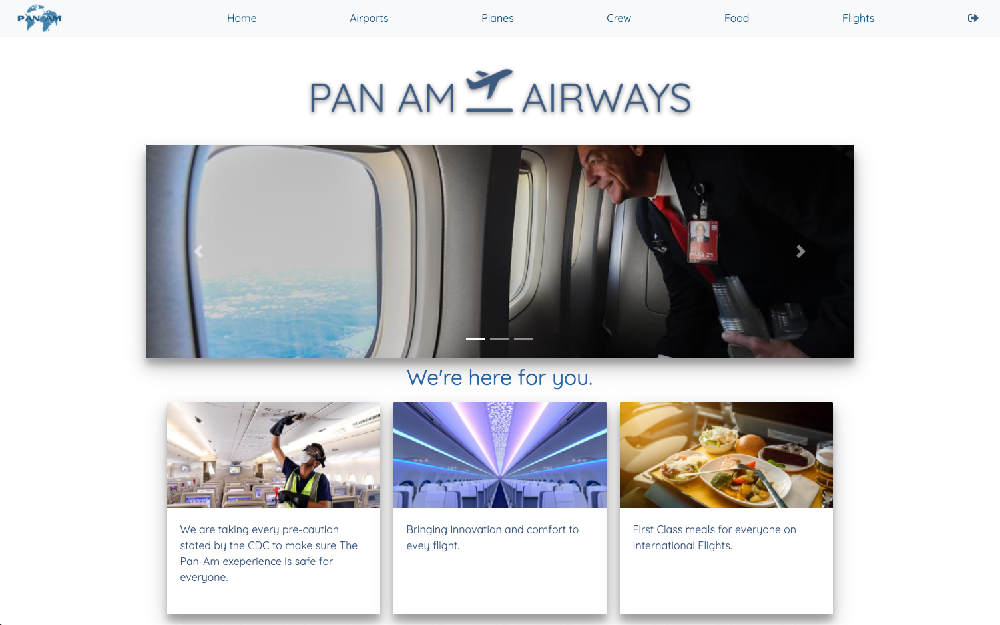
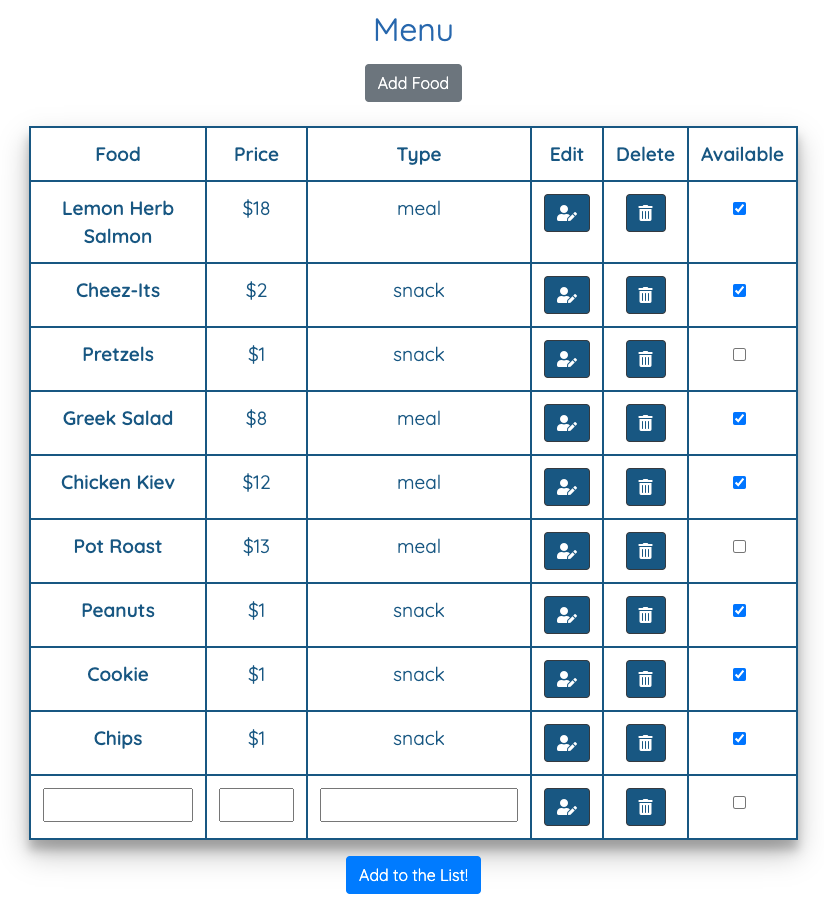
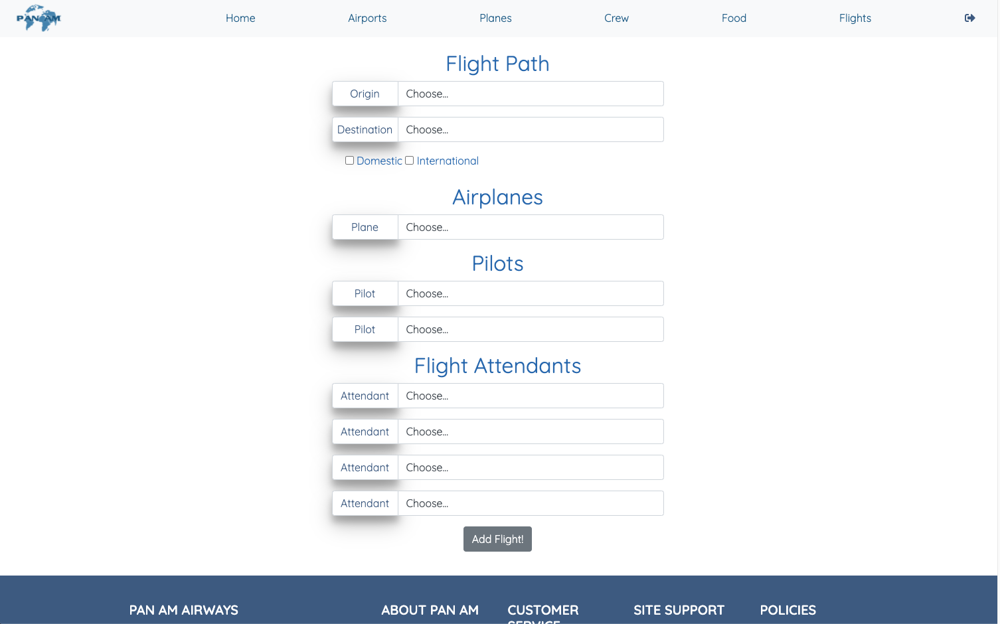
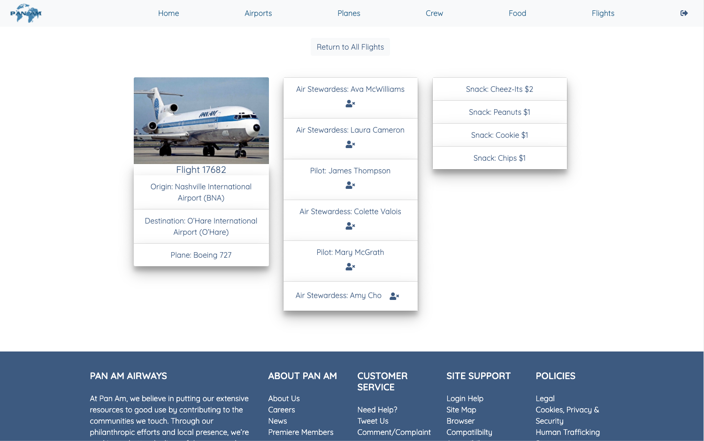

# Nutshell Group Project - PanAm Airlines

## Description
This is a 3-person group project that allowed us to practice using a Firebase database. It has an airline theme and is designed to allow the user to maintain a database of planes, airports, crew, and menu offerings so that they can plan and build flights that incorporate all of those components. We knew that the project would be split into two parts but we were surprised to be told after part 1 that we would be trading projects with another group. This part 2 final product was started by a different group and then we inherited their code to finish out the project so that we could get some real-world practice working with other developers' code.

### Feature List
* Deployed site with Google authentication login
* Data hosted in a Firebase realtime database
* Read-only mode for logged-out users and CRUD compatibility for logged-in users
* Logged-in users can view, add, edit, or delete individual components
* Logged-in users can view, create, or delete entire flights
* Fully branded site

### How To Run
1. Clone the repo to have it on your local machine along with all of the webpack components
1. Use `npm start` to start up a local server
1. Visit the server in your browser (should launch automatically and defaults to localhost:8080)
1. Visit the deployed site at https://panam-10421.web.app/

### Screenshots

### Contributors
* [Brooke Nemchak](https://github.com/bnemchak) (part 1)
* [Mark Young](https://github.com/MarkyAaronYoung) (part 1)
* [Phonesalo Sihanorak](https://github.com/psihanorak) (part 1)
* [Jeanine Beckle](https://github.com/jeaninebeckle) (part 2)
* [Jim Browning](https://github.com/jamalbrowning) (part 2)
* [Billy Campbell](https://github.com/wcampbell91) (part 2)
